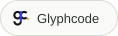
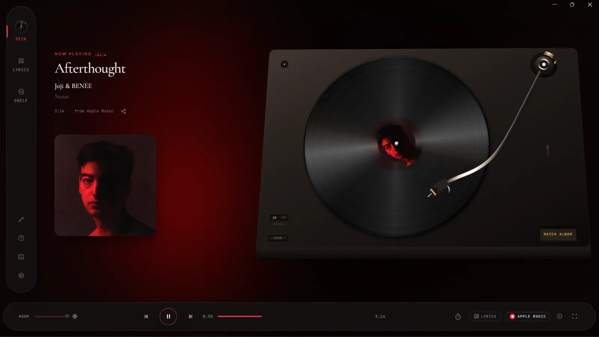
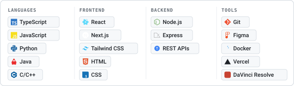
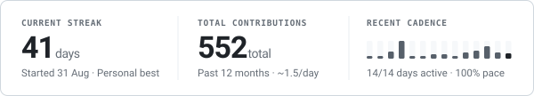
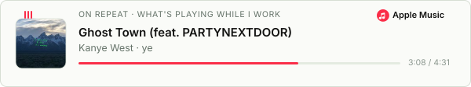
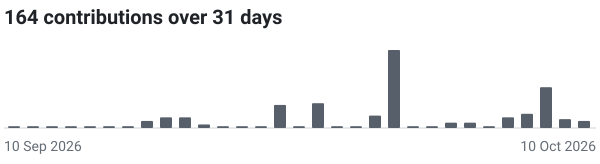

<picture>
  <source media="(max-width: 600px) and (prefers-reduced-motion: reduce) and (prefers-color-scheme: dark)" srcset="assets/cover-dark-mobile-static.svg">
  <source media="(max-width: 600px) and (prefers-reduced-motion: reduce)" srcset="assets/cover-light-mobile-static.svg">
  <source media="(prefers-reduced-motion: reduce) and (prefers-color-scheme: dark)" srcset="assets/cover-dark-static.svg">
  <source media="(prefers-reduced-motion: reduce)" srcset="assets/cover-light-static.svg">
  <source media="(max-width: 600px) and (prefers-color-scheme: dark)" srcset="assets/cover-dark-mobile.svg">
  <source media="(max-width: 600px)" srcset="assets/cover-light-mobile.svg">
  <source media="(prefers-color-scheme: dark)" srcset="assets/cover-dark.svg">
  
</picture>

I'm a **Full-stack developer & UI engineer** in Bengaluru, designing and building thoughtful digital products.  
Music, football, and my hometown tend to find their way into what I make.

  <a href="https://www.namanbagdiya.tech/"><picture><source media="(prefers-color-scheme: dark)" srcset="assets/link-portfolio-dark.svg"></picture></a> &nbsp;
  <a href="https://www.glyphcode.studio/"><picture><source media="(prefers-color-scheme: dark)" srcset="assets/link-glyphcode-dark.svg"></picture></a> &nbsp;
  <a href="https://www.linkedin.com/in/namanbagdiya/"><picture><source media="(prefers-color-scheme: dark)" srcset="assets/link-linkedin-dark.svg"></picture></a> &nbsp;
  <a href="https://monkeytype.com/profile/NamanOG"><picture><source media="(prefers-color-scheme: dark)" srcset="assets/link-monkeytype-dark.svg"></picture></a> &nbsp;
  <a href="https://instagram.com/namaan_b"><picture><source media="(prefers-color-scheme: dark)" srcset="assets/link-instagram-dark.svg"></picture></a> &nbsp;
  <a href="mailto:namanbagdiya@outlook.com"><picture><source media="(prefers-color-scheme: dark)" srcset="assets/link-email-dark.svg"></picture></a>

## Selected work

### [Kissa](https://kissa.glyphcode.studio/)

A vinyl-inspired listening companion for Windows. Synced lyrics, a turntable,
and ambient listening rooms, following your active music session.

Electron · React · TypeScript · C#

<a href="https://github.com/NamanOG/Kissa"><picture><source media="(prefers-color-scheme: dark)" srcset="assets/link-github-dark.svg"></picture></a> &nbsp; <a href="https://apps.microsoft.com/detail/9p3n4x4wm80j"><picture><source media="(prefers-color-scheme: dark)" srcset="assets/link-store-dark.svg"></picture></a>

**[Raipur.life](https://raipur.life/)** &nbsp; A guide to the city I grew up in: places, food, events, and community stories.  
React · TypeScript · Supabase

<a href="https://github.com/NamanOG/raipurlife"><picture><source media="(prefers-color-scheme: dark)" srcset="assets/link-github-dark.svg"></picture></a> &nbsp; <a href="https://raipur.life/"><picture><source media="(prefers-color-scheme: dark)" srcset="assets/link-live-dark.svg"></picture></a>

**[Casa del Fútbol](https://casadelfutbol.vercel.app/)** &nbsp; Clubs, leagues, tactical stories, and interactive football experiences.  
Next.js · TypeScript

<a href="https://github.com/NamanOG/CasaDelFutbol"><picture><source media="(prefers-color-scheme: dark)" srcset="assets/link-github-dark.svg"></picture></a> &nbsp; <a href="https://casadelfutbol.vercel.app/"><picture><source media="(prefers-color-scheme: dark)" srcset="assets/link-live-dark.svg"></picture></a>

**[Karobar](https://karobar-game.vercel.app/)** &nbsp; A multiplayer property-trading board game. Best played with friends who can take a loss.  
Multiplayer · Web game

<a href="https://github.com/NamanOG/Karobar"><picture><source media="(prefers-color-scheme: dark)" srcset="assets/link-github-dark.svg"></picture></a> &nbsp; <a href="https://karobar-game.vercel.app/"><picture><source media="(prefers-color-scheme: dark)" srcset="assets/link-play-dark.svg"></picture></a>

**[Mercedes-AMG F1](https://amg-formula1.vercel.app/)** &nbsp; Race weekend showcase and telemetry interactive experience for Mercedes-AMG Petronas.  
Next.js · TypeScript

<a href="https://github.com/NamanOG/AMG-Formula1"><picture><source media="(prefers-color-scheme: dark)" srcset="assets/link-github-dark.svg"></picture></a> &nbsp; <a href="https://amg-formula1.vercel.app/"><picture><source media="(prefers-color-scheme: dark)" srcset="assets/link-live-dark.svg"></picture></a>

## Toolbox

<picture>
  <source media="(max-width: 600px) and (prefers-color-scheme: dark)" srcset="assets/tech-dark-mobile.svg">
  <source media="(max-width: 600px)" srcset="assets/tech-light-mobile.svg">
  <source media="(prefers-color-scheme: dark)" srcset="assets/tech-dark.svg">
  
</picture>

For Kissa: Electron, React, TypeScript, and C#.

## After hours

The contribution calendar, taking the scenic route.

<picture>
  <source media="(prefers-reduced-motion: reduce) and (prefers-color-scheme: dark)" srcset="stats/contributions-dark.svg">
  <source media="(prefers-reduced-motion: reduce)" srcset="stats/contributions-light.svg">
  <source media="(prefers-color-scheme: dark)" srcset="https://raw.githubusercontent.com/NamanOG/NamanOG/output/github-snake-dark.svg">
  
</picture>

<picture>
  <source media="(prefers-color-scheme: dark)" srcset="stats/streak-dark.svg">
  
</picture>

### On repeat lately

<a href="https://music.apple.com/us/album/ghost-town-feat-partynextdoor/1441460375?i=1441460621&uo=4"><picture>
  <source media="(prefers-color-scheme: dark)" srcset="assets/apple-music-dark.svg">
  
</picture></a>

Activity &amp; milestones

<picture>
  <source media="(prefers-color-scheme: dark)" srcset="stats/activity-dark.svg">
  
</picture>

<picture>
  <source media="(prefers-color-scheme: dark)" srcset="stats/trophy-dark.svg">
  
</picture>

Activity comes from GitHub's public calendar. Milestones are generated by <a href="https://github.com/ryo-ma/github-profile-trophy">GitHub Profile Trophy</a>.

---

Fuelled by caffeine and music on loop. Usually building something, listening to music, or watching football.

